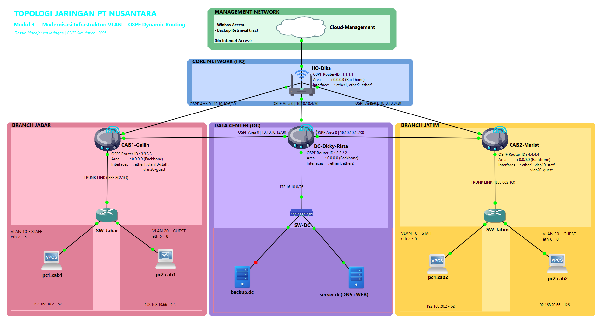

# Modernisasi Infrastruktur Jaringan Multi-Cabang: Integrasi VLAN, Router-on-a-Stick, OSPF, dan Partial Mesh

> **Supplementary Material** — Repository ini berisi konfigurasi lengkap, dokumentasi topologi, dan pengalamatan IP yang menjadi pelengkap artikel ilmiah dengan judul yang sama. Seluruh file konfigurasi diekstrak dari hasil implementasi simulasi GNS3 dan telah diverifikasi melalui 19 skenario pengujian.

---

## Deskripsi Penelitian

Penelitian ini mendokumentasikan modernisasi infrastruktur jaringan **PT Nusantara Retail Digital** dari arsitektur hub-and-spoke dengan static routing menjadi arsitektur partial mesh dengan OSPF dynamic routing. Modernisasi dilaksanakan dalam lingkungan simulasi **GNS3** menggunakan **MikroTik Cloud Hosted Router (CHR) RouterOS v7**.

Modernisasi mengintegrasikan empat komponen:

1. **Segmentasi VLAN** — Bridge VLAN Filtering (IEEE 802.1Q) untuk memisahkan traffic Staf (VLAN 10) dan Tamu (VLAN 20)
2. **Inter-VLAN Routing** — Teknik Router-on-a-Stick menggunakan sub-interface pada router cabang
3. **OSPF Dynamic Routing** — Migrasi dari static routing ke OSPF untuk kemampuan self-healing
4. **Partial Mesh Topology** — Penambahan link backup DC↔Cabang untuk mengeliminasi single point of failure pada router HQ

## Tujuan Repository

Repository ini berfungsi sebagai **supplementary material** yang dirujuk pada bagian Research Method (BAB 2) artikel ilmiah. Tujuannya:

- Menyediakan **konfigurasi CLI lengkap** seluruh perangkat jaringan agar pembaca dapat mereplikasi simulasi
- Mendokumentasikan **pengalamatan IP** dan **topologi jaringan** secara terstruktur
- Memindahkan detail teknis konfigurasi dari badan artikel ke repository, sesuai praktik penulisan ilmiah

---

## Topologi Jaringan



Topologi terdiri dari 4 lokasi: **Head Office (HQ)**, **Data Center (DC)**, **Cabang Jawa Barat**, dan **Cabang Jawa Timur**. Arsitektur partial mesh menambahkan dua link backup langsung dari DC ke masing-masing cabang, sehingga HQ bukan lagi single point of failure.

### Jalur Routing

| Kondisi | Jalur | Jumlah Hop |
|---------|-------|------------|
| **Normal** (HQ aktif) | Cabang → HQ-Dika → DC-Dicky-Rista → server.dc | 3 hop |
| **Failover** (HQ down) | Cabang → DC-Dicky-Rista → server.dc (langsung) | 2 hop |

Rata-rata waktu failover OSPF: **36,73 detik** (< 1 dead interval 40 detik), tanpa intervensi administrator.

---

## Daftar Perangkat

| Komponen | Nama Perangkat | Platform | Fungsi | OSPF Router-ID |
|----------|----------------|----------|--------|----------------|
| Router HQ | HQ-Dika | MikroTik CHR v7 | Hub utama, jalur transit primer | 1.1.1.1 |
| Router DC | DC-Dicky-Rista | MikroTik CHR v7 | Gateway LAN Data Center | 2.2.2.2 |
| Router Cab. Jabar | CAB1-Galih | MikroTik CHR v7 | Inter-VLAN Routing, Jawa Barat | 3.3.3.3 |
| Router Cab. Jatim | CAB2-Marist | MikroTik CHR v7 | Inter-VLAN Routing, Jawa Timur | 4.4.4.4 |
| Switch Jabar | SW-Jabar | MikroTik CHR v7 | Managed switch, Bridge VLAN Filtering | — |
| Switch Jatim | SW-Jatim | MikroTik CHR v7 | Managed switch, Bridge VLAN Filtering | — |
| Server DC | server.dc | Debian Linux | DNS (Bind9) + Web Server (Apache2) | — |
| Klien | pc1.cab1, pc2.cab1, pc1.cab2, pc2.cab2 | VPCS / Win7 | Klien VLAN 10 (Staf) dan VLAN 20 (Tamu) | — |

---

## Struktur Repository

```
modernisasi-jaringan-vlan-ospf/
├── README.md                              ← Anda sedang membacanya
├── LICENSE                                ← CC BY 4.0
├── .gitignore
├── artikel.md                             ← Draft artikel ilmiah (format KINETIK)
│
├── configs/                               ← Konfigurasi CLI per perangkat
│   ├── routers/
│   │   ├── HQ-Dika.rsc                    ← OSPF config router HQ
│   │   ├── DC-Dicky-Rista.rsc             ← OSPF + backup interface DC
│   │   ├── CAB1-Galih.rsc                 ← VLAN + OSPF + backup CAB1
│   │   └── CAB2-Marist.rsc                ← VLAN + OSPF + backup CAB2
│   ├── switches/
│   │   ├── SW-Jabar.rsc                   ← Bridge VLAN Filtering Jabar
│   │   └── SW-Jatim.rsc                   ← Bridge VLAN Filtering Jatim
│   └── clients/
│       └── client-ip-config.md            ← IP config keempat klien
│
├── docs/                                  ← Dokumentasi pendukung
│   ├── ip-addressing.md                   ← Tabel IP addressing lengkap
│   ├── laporan-praktikum.md               ← Laporan praktikum lengkap (sumber data)
│   └── Template Kinetik Mendeley.docx     ← Template jurnal KINETIK
│
├── images/                                ← Screenshot bukti pengujian (untuk artikel)
│   ├── ospf-3neighbor-full.png            ← OSPF Neighbor DC — 3 neighbor Full
│   ├── routing-table-normal.png           ← Routing table CAB1 normal (via HQ)
│   ├── routing-table-failover.png         ← Routing table CAB1 failover (via DC)
│   └── traceroute-failover.png            ← Traceroute failover (2 hop)
│
└── topology/                              ← Topologi jaringan
    ├── topology.png                       ← Diagram topologi final (GNS3)
    └── topology-description.md            ← Deskripsi komponen dan jalur routing
```

---

## Cara Menggunakan File Konfigurasi

### Prasyarat

- **GNS3** versi 2.2+ terinstall
- **MikroTik CHR image** (RouterOS v7) sudah terdaftar sebagai appliance di GNS3
- Pemahaman dasar tentang MikroTik RouterOS CLI

### Langkah Penggunaan

1. **Buat topologi di GNS3** sesuai diagram pada `topology/topology.png`
2. **Konfigurasikan IP address** pada setiap perangkat sesuai tabel di `docs/ip-addressing.md`
3. **Import konfigurasi** ke masing-masing perangkat MikroTik:

   ```bash
   # Upload file .rsc ke router MikroTik (via Winbox drag-and-drop atau SCP)
   # Kemudian jalankan di terminal MikroTik:
   /import file=nama-file.rsc
   ```

4. **Urutan konfigurasi yang disarankan:**

   | Urutan | Perangkat | File | Keterangan |
   |--------|-----------|------|------------|
   | 1 | SW-Jabar | `configs/switches/SW-Jabar.rsc` | Bridge VLAN Filtering |
   | 2 | SW-Jatim | `configs/switches/SW-Jatim.rsc` | Bridge VLAN Filtering |
   | 3 | CAB1-Galih | `configs/routers/CAB1-Galih.rsc` | Inter-VLAN + OSPF + Backup |
   | 4 | CAB2-Marist | `configs/routers/CAB2-Marist.rsc` | Inter-VLAN + OSPF + Backup |
   | 5 | HQ-Dika | `configs/routers/HQ-Dika.rsc` | OSPF |
   | 6 | DC-Dicky-Rista | `configs/routers/DC-Dicky-Rista.rsc` | OSPF + Backup Interface |
   | 7 | Klien | `configs/clients/client-ip-config.md` | IP address assignment |

5. **Verifikasi** setelah konfigurasi selesai:

   ```bash
   # Cek OSPF neighbor (harus Full)
   /routing ospf neighbor print

   # Cek routing table (harus ada flag DAo)
   /ip route print

   # Cek VLAN interface
   /interface vlan print
   ```

### Catatan Penting

- File `.rsc` berisi perintah konfigurasi **tambahan** (bukan full export). Beberapa perintah mengasumsikan perangkat dalam kondisi default.
- Konfigurasi `static route` harus dinonaktifkan terlebih dahulu sebelum OSPF diaktifkan (sudah termasuk dalam file `.rsc`).
- OSPF cost=100 pada `ether3` di CAB1 dan CAB2 memastikan HQ tetap menjadi primary path saat kondisi normal.

---

## Hubungan dengan Artikel Ilmiah

Repository ini merupakan **supplementary material** dari artikel ilmiah:

> **Modernisasi Infrastruktur Jaringan Multi-Cabang melalui Integrasi VLAN, Router-on-a-Stick, OSPF, dan Partial Mesh**

Artikel memuat analisis dan pembahasan hasil penelitian, sedangkan repository ini menyimpan:

- Konfigurasi CLI lengkap yang terlalu panjang untuk dimuat dalam badan artikel
- Tabel IP addressing sebagai referensi cepat
- Diagram topologi dalam resolusi penuh
- Laporan praktikum lengkap sebagai sumber data primer

Hubungan ini dirujuk pada **BAB 2 (Research Method)** artikel dengan keterangan:

> *"Konfigurasi lengkap seluruh perangkat tersedia pada repositori GitHub: [URL repository]"*

---

## Penulis

| Nama | NIM |
|------|-----|
| M. Dicky Andrean | 230602070 |
| Rista Ifanka | 230602065 |
| Marist Zaimah | 230602024 |
| Suprobo Galih S | 230602060 |
| Alvian Ramandika | 230602069 |

**Program Studi Teknik Informatika, Fakultas Teknik**
**Universitas Muhammadiyah Gresik — 2026**

**Dosen Pengampu:** Andy Muhammad Teguh, S.Kom., M.Kom.

---

## Lisensi

Repository ini dilisensikan di bawah **[Creative Commons Attribution 4.0 International (CC BY 4.0)](LICENSE)**.

Anda bebas untuk menyalin, mendistribusikan, dan mengadaptasi materi ini untuk keperluan apapun, termasuk komersial, selama Anda memberikan atribusi yang sesuai.
